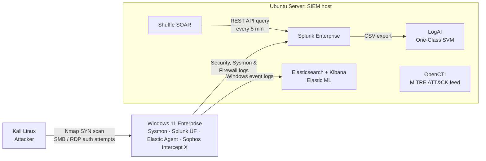
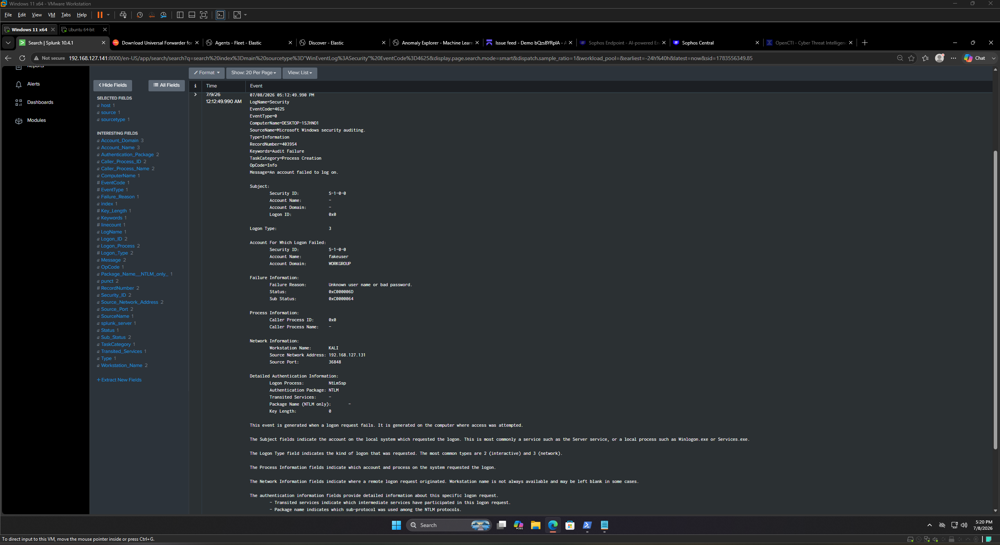

# AI-Augmented SOC Implementation for Enterprise Threat Detection & Response

> Course-end project · Advanced Executive Program in Cybersecurity · IIIT-Bangalore × Simplilearn · July 2026

A three-VM security operations lab that ingests endpoint telemetry into two SIEMs, applies machine-learning anomaly detection, enriches with threat intelligence, hunts a simulated attack across log sources, and automates detection with a SOAR playbook. It ends with a MITRE ATT&CK / D3FEND coverage map and a prioritised gap analysis.

📄 **[Read the full 36-page report](report/AI-Augmented-SOC-Report.pdf)**

---

## Executive Summary

I built a working SOC pipeline from scratch and then attacked it. The most important result wasn't a detection. It was a blind spot: **a full port scan against the Windows endpoint produced zero log entries**, because Windows Firewall doesn't log blocked connections by default. Once I enabled that logging, the same attacker IP could be traced across two independent log sources (network and authentication), and the attack became unambiguous.

The project closes with an honest assessment: **3 ATT&CK techniques detected with evidence, 7 detectable, 1 partial**, and **4 defensive gaps** translated into a prioritised remediation plan.

## Why This Matters (Business Impact)

| What the lab showed | What it means for an organisation |
|---|---|
| Default Windows config hid an entire reconnaissance phase | A SOC can be fully deployed and still blind. Tooling isn't visibility; configuration is. |
| No single log source told the full story | Centralised logging earns its cost through correlation, not collection. |
| TheHive failed on a shared, under-provisioned host | Security tooling needs capacity planning. Under-resourced tools fail quietly. |
| The SOAR playbook detects but doesn't yet contain | Detection without automated response still depends on a human being awake. |

## Lab Architecture



All VMs run in VMware Workstation Pro on an isolated lab network.

| Layer | Tool | Purpose |
|---|---|---|
| Endpoint telemetry | Sysmon (SwiftOnSecurity config) | Process, network, and file events beyond default Windows logging |
| SIEM | Splunk Enterprise + Universal Forwarder | Primary log ingestion and hunting (SPL) |
| SIEM | Elastic Stack + Elastic Agent | Parallel ingestion; prebuilt ML anomaly jobs |
| AI detection | LogAI (Salesforce) | Log template extraction (Drain) + One-Class SVM anomaly detection |
| AI detection | Elastic ML | 8 Windows security anomaly jobs (rare services, RDP, process relationships) |
| AppSec | Aikido | Code / dependency / cloud-config scanning (demo workspace) |
| EDR | Sophos Intercept X | Deep-learning malware, ransomware, and exploit protection |
| Threat intel | OpenCTI | 725 malware entities and 181 intrusion sets from MITRE ATT&CK |
| SOAR | Shuffle | Automated failed-logon detection playbook |

## The Attack and the Hunt

1. **Recon:** full-range TCP SYN scan (65,535 ports) from Kali against the endpoint.
2. **Credential attack:** failed SMB and RDP logons with fabricated credentials.
3. **First hunt: zero results.** The firewall had silently dropped every scan packet without logging it.
4. **Fix:** enabled blocked-connection logging on all firewall profiles and forwarded `pfirewall.log` to Splunk.
5. **Pivot:** the attacker IP appeared in **18 firewall DROP events** (network layer) and **2 Event ID 4625 failed logons** (authentication layer, logon type 3, NTLM, workstation `KALI`).



## Key Findings & Recommendations

| # | Finding | Risk | Recommendation | Priority |
|---|---|---|---|---|
| 1 | Windows Firewall doesn't log blocked connections by default | Reconnaissance is invisible to the SOC | Enable `LogBlocked` on all profiles via GPO | Immediate |
| 2 | Sysmon config is conservative on network events (Event ID 3) | SYN scans leave no endpoint trace | Tune Sysmon on high-value hosts, or add Zeek / Suricata | Immediate |
| 3 | Case management (TheHive) couldn't stabilise on the shared host | No structured incident tracking | Dedicated host with ≥16 GB RAM, or managed instance | 30–60 days |
| 4 | Threat intel isn't wired into the playbook | Alerts lack context for prioritisation | Add an OpenCTI enrichment step to the Shuffle workflow | 30–60 days |
| 5 | Threat hunting is manual | New IOCs never checked against historical logs | Sigma rules as scheduled Splunk searches feeding Shuffle | 30–60 days |
| 6 | No executable allowlisting | Malware is caught only after it runs | WDAC in audit mode, then enforcement | 60–180 days |
| 7 | No MFA or credential hardening | One weak password means successful lateral movement | MFA, LAPS, password protection | 60–180 days |
| 8 | Playbook detects but doesn't contain | Response still depends on manual action | Add EDR isolation, account disable, and IP block actions | 60–180 days |

## Coverage Mapping

**MITRE ATT&CK:** 3 Detected · 7 Detectable · 1 Partial

Detected with evidence: T1595.001 (Active Scanning), T1046 (Network Service Discovery), T1110.001 (Password Guessing).

**MITRE D3FEND:** 6 Implemented · 2 Partial · 4 Gaps

Gaps: Executable Allowlisting, MFA, Credential Hardening, Decoy Environment.

Full tables are in Sections 10.4 and 10.5 of the [report](report/AI-Augmented-SOC-Report.pdf).

## SOAR Playbook: Failed Logon Auto-Response

`Schedule (every 5 min)` → `Splunk REST search (EventCode 4625)` → `Filter (proceed only if 4625 present)`

The filter is the guard clause. The workflow stays silent on empty polls and only proceeds when there's something worth acting on. It's the hook point for future containment actions.

## Engineering Problems Solved

| Problem | Root cause | Fix |
|---|---|---|
| Splunk failed to start silently | Splunk 10.4.1 aborts when run as root without acknowledgement | `--run-as-root` flag |
| Sysmon events not reaching Splunk | Forwarder's service account lacked channel read access (error 5) | Least privilege: added to *Event Log Readers* instead of running as Local System |
| LogAI wouldn't install | Python 3.14 broke gensim's C extensions | Isolated Conda Python 3.10 environment |
| LogAI flagged 45% of time buckets | Default One-Class SVM `nu=0.5` | Tuned to `nu=0.1` via typed params object |
| Shuffle couldn't start | Port 9200 already held by native Elasticsearch | Remapped host port to 9201 |
| Shuffle couldn't reach Splunk | `localhost` inside a container is the container | Targeted the host IP on port 8089 |

## Limitations

- TheHive was documented as a capacity gap rather than deployed.
- The playbook covers detection and conditional logic; containment actions are the next layer.
- Seven ATT&CK techniques are detectable but weren't triggered with test traffic.
- Elastic ML ran on a 30-day trial licence.

## Repository Contents

```
├── README.md
├── report/        Full project report (PDF)
└── evidence/      Screenshots organised by task (task1 … task4)
```

## Disclaimer

All activity was performed in an isolated, self-owned lab environment for educational purposes. No production systems were targeted.
